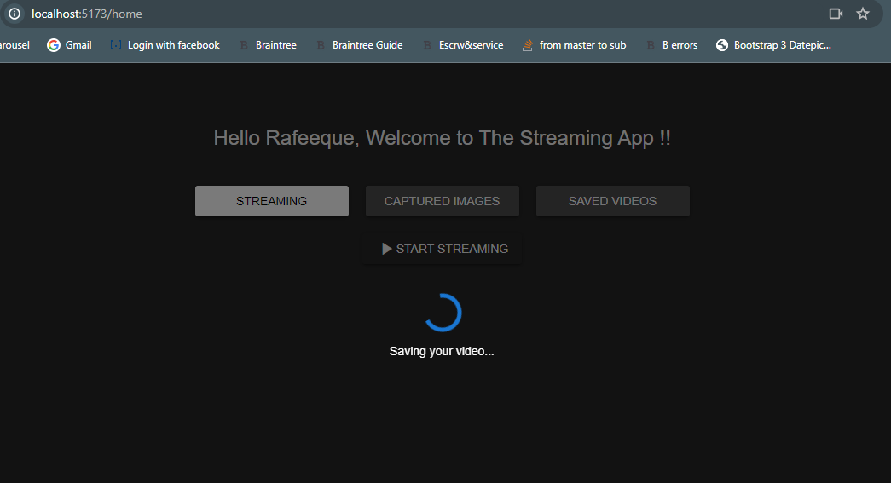

# Video Streaming Application

The `Video Streaming Application` was designed to live stream the video and save it in the system. It has the following features,

- Login with social media accounts
- Live stream the video from the webcam
- Save the streamed video in the system
- Take snapshots during the playback and save the images
- List the captured images and a image slider
- List the streamed videos and option to playback them again
- List the image frames in a grid and filter by the dates
- Integrated the secure API system by using `JWT` token
- Integrated authentication and authorization
- And so on..

`If you encounter any difficulties while setting up the project, feel free to contact me at rafeequekhp134@gmail.com.`

## Project Directories

- It has two directories: `frontend` and `backend`
- `frontend` folder is the UI application
- `backend` folder handles the backend logic

## Requirements

This project requires the following:

* Node.js v20.10.0
* MongoDB

Please ensure that you have these versions installed before proceeding with the setup.

## Project Setup

Follow these steps to set up the project:


1. **Switch to node 20.10.0**

    ```bash
    nvm use v20.10.0
    ```

2. **Clone the repository**

    ```bash
    git clone https://github.com/rafeeeque/video-streaming-app.git
    ```

3. **Change into the project directory**

    ```bash
    cd video-streaming-app
    ```

4. **Setup the frontend**

    Please follow the below steps to setup the frontend

    4.1 **Change to the frontend**

        ```bash
        cd frontend
        ```

    4.2 **Install Packages**

        ```bash
        npm i
        ```

    4.3 **Setup .env file**

        Copy the `.env.example` file into `.env` and change the values if required.

        ```bash
        cp .env.example .env
        ```

    4.3 **Start the frontend App**

        ```bash
        npm start
        ```

        This will start the app in `http://localhost:5173/`

5. **Setup the backend**

    Please follow the below steps to setup the backend

    5.1 **Change to the backend**

        ```bash
        cd backend
        ```

    5.2 **Install Packages**

        ```bash
        npm i
        ```

    5.3 **Setup .env file**

        - Copy the `.env.example` file into `.env` and change the values if required.
        - `VITE_API_BASE_URL` needs to be the `API URL`

        ```bash
        cp .env.example .env
        ```
    
    5.4 **Create Google Client ID and Secret**

        - Create Google Client ID and Secret Key and replace the env variables `GOOGLE_CLIENT_ID` and `GOOGLE_CLIENT_SECRET`
        - Add `http://localhost:5000/auth/google/callback` as the `redirect URI` which creating the app.
        - The credentials which is already there was from `my account`. If you want ot use that, then please do let me know your google account, I can add you as a `tester`.

    5.5 **Start the backend App**

        ```bash
        npm start
        ```

        This will start the app in `http://localhost:5000/`


## Using the Application

    Now, your application is ready. Open your web browser and visit `http://localhost:5173/`.

    

1. **Login**

    - Click on the "Login with Google". This will let you login with your Google account.
    - It'll also create a user account in our system.

     

2. **Start Streaming**

    - Click on `Start Streaming` button from the first tab to start streaming the video. This will ask for the webcam permission.

    

3. **Capture Snapshots**

    - Click on `Snap` button below the video playback to take a snapshot, this will automatically save the image.
    - This will upload the image to `/uploads/images` folder and keep the details in the database.

    

4. **Stop Streaming**

    Click on `Stop` button below the video playback to stop video streaming, this will automatically save the video.
    - This will upload the video to `/uploads/videos` folder and keep the details in the database.

    

5. **View Image Frames**

    Go to the tab `Captured Images` to see the captured frames. Clicking on an image will open a slider of all the images.

    
    

6. **Image Frames Listing Grid**

    Click on the button `Detailed Grid` to see a detailed grid of images frames with the user information and the date time. We can view the image, filter the data etc.

    

7. **View Saved Videos**

    Go to the tab `Saved Videos` to see the saved videos. Clicking on a video will open a slider of all the vidoes where we can play each video.

    
    

### Pending

Below are the items which are pending from the requirements,

1. Login with `Facebook` and `LinkedIn`
2. Email notification when saving an image frame
3. Share the image through `WhatsApp`

### Note

I'll be able to work on the pending items if needed. Finished this system in 2 days taking 8 - 9 hours in total.

Feel free to contact me at `rafeequekhp134@gmail.com` for any help to setup the project.